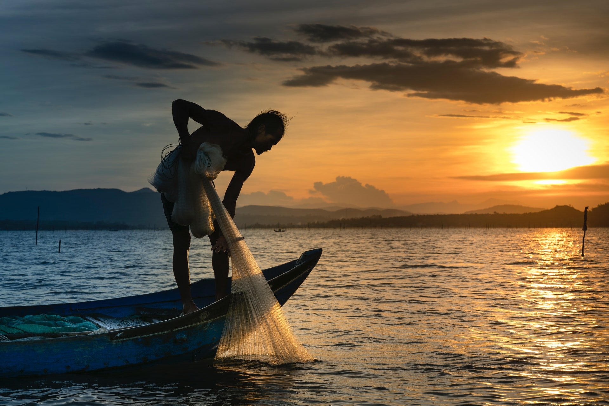

> Styles: [English](README.md), [Odia](Odia.md), [Translated](Translated.md).<br>
> [Click here to listen](https://soundcloud.com/user-963789405/ivdvbl6wkyim).

```
False and magic, not this world,
All are our own,
Our brothers, friends and relatives,
No one is distant,
All are our own.

Age after age, time goes by,
Relationships turned sweet,
Sweeter than honey, juicer than mangoes,
Kindness is standing.

Love and affection, the fragrance is out,
Moon floated out of society,
As the sky, with life,
Comes down to land.

From one eye, tears streamed,
A million humans cry,
Life merged, with life,
Fills world with delusions.

The moving world, some suffering,
Let a new morning come,
Nature’s queen, newly dressed,
Let true beauty come out.

In the fifth tone, in the voice of Koel,
Can hear from the dawn,
Diba and Yamini, in the arms of the earth,
Pure harmony flows.

Earth’s water, blueness is seen,
The stars are blazing in the sky,
Is it the heaven, coming down,
To the earth’s arms.
```

- Poem by Snigdharani Sahoo
- Photo by Quang Nguyen Vinh from Pexels
